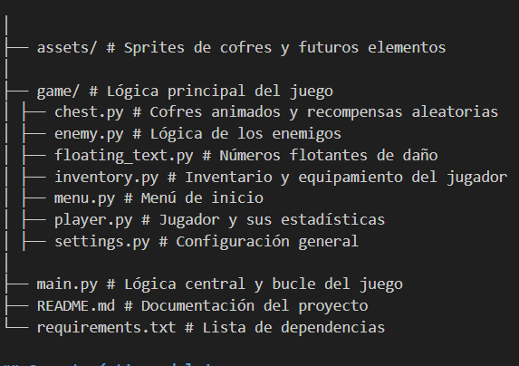

# Jardín de los Secretos / Garden of Secrets (Hecho con PyGame)

Este es un juego desarrollado con **PyGame**, donde el jugador puede explorar, combatir enemigos, abrir cofres y equipar distintos objetos como armas, armaduras y zapatos que afectan sus estadísticas. Cuenta con interfaz de inventario, sistema de aparición progresiva de enemigos, animaciones básicas y una experiencia fluida sin necesidad de imágenes externas.

---

## Tabla de Contenidos

- [Requisitos](#requisitos)
- [Instalación](#instalación)
- [Ejecución del juego](#ejecución-del-juego)
- [Estructura del proyecto](#estructura-del-proyecto)
- [Características del juego](#características-del-juego)
- [Controles](#controles)
- [Créditos](#créditos)

---

## Requisitos

- Python 3.10 o superior
- Paquetes:
  - `pygame`
  - `pygame-menu`
  - `pygame_gui`

Puedes generar un archivo con las dependencias del entorno virtual ejecutando:

```bash
pip freeze > requirements.txt
```

## Instalación

- 1. Clona este repositorio:
     `git clone https://github.com/tu-usuario/aventura-pygame.git`
     `cd aventura-pygame`

- 2. Instala las dependencias necesarias:
     `pip install pygame pygame-menu pygame_gui`

## Ejecución del juego

Para ejecutar el juego, simplemente corre el archivo main.py desde la terminal:
`python main.py`

## Estructura del proyecto



## Características del juego

✅ Menú inicial con nombre personalizado

✅ Movimiento libre del personaje (WASD)

✅ Ataque cuerpo a cuerpo (barra espaciadora)

✅ Enemigos con distintos niveles de vida y daño

✅ Sistema de cofres con animación y apertura manual (tecla E)

✅ Recompensas aleatorias con probabilidades ajustadas

✅ Sistema de inventario visual (tecla I)

✅ Equipamiento de armas, armaduras y zapatos

✅ Cambios de estadísticas según equipo

✅ Historial de objetos obtenidos (avisos temporales)

✅ Aparición progresiva de enemigos tras desplazamiento

✅ Representación visual del jugador y enemigos por figuras básicas con estilo

✅ Fondo visual atractivo generado por código

## Controles

- W / A / S / D: Moverse
- SPACE: Atacar
- E: Abrir cofres
- I: Inventario (equipar/desequipar objetos)
